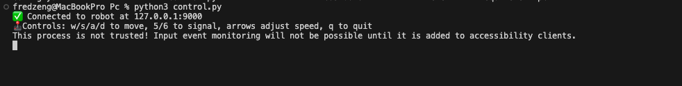
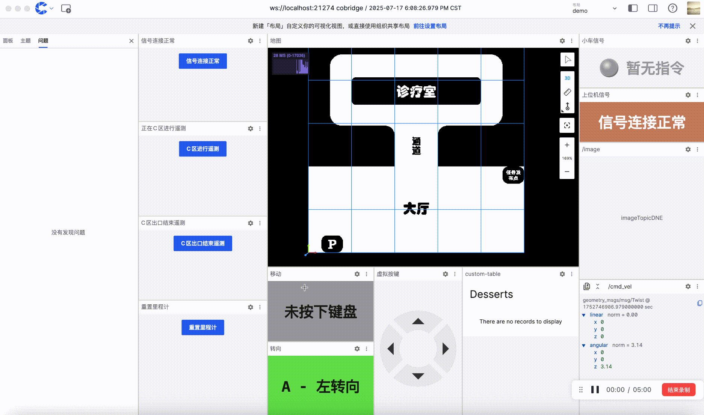

在本次智能车比赛中，实时性、资源占用和稳定性，是控制系统的重要要求。很多参赛者在搭建控制平台时，会优先使用 rosbridge，但很快就会发现它在高并发、低带宽的环境下不堪重负。
因此，我们基于实际场景需求，设计并实现了 cobridge —— 一个用 C++ 实现的高性能通信桥，用来替代 rosbridge，构建更加稳定、低延迟的车载控制系统。

# 为什么 rosbridge 不再适合？
虽然rosbridge 提供了一整套 WebSocket 接口，让非 ROS 环境也可以实现 地图发布、指令下发和 键盘控制 使得开发者可以在非 ROS 环境下对 ROS 系统进行读写操作。然而，它本身是 Python 实现的，存在以下几个问题：

- 资源占用高：Python 天然的解释执行机制，导致 CPU 和内存占用相对较高。
- 网络延迟大：数据传输过程中缺乏流控机制，容易出现堆积或卡顿。
- 缺乏实时机制：对消息优先级的管理缺失，容易造成高优先级控制命令被淹没。

# cobridge：我们重新定义的智能车通信桥

为了解决 rosbridge 的一系列痛点，我们基于 C++ 开发了 cobridge，它从根本上优化了系统性能，具备以下优势：
- ✅ 高性能低资源消耗：C++ 编译执行效率远胜 Python，占用资源更少，运行更稳定。
- ⏱️ 实时性强：内置优先级队列，在网络波动时主动丢弃低优先级包，确保关键控制信息实时传达。
- 🔁 全版本兼容：支持 ROS1（Indigo 到 Noetic）和 ROS2（Foxy 到 Jazzy），无需担心版本割裂问题。
- 🌐 云端友好：配套 coStudio客户端，直接可用，无需自建客户端，节省大量开发时间。
- 🧠 URDF 渲染支持：搭配 coStudio 和云端平台，可直接渲染机器人模型，而 rosbridge 无法胜任。


# 使用指南：
🚗 车端部署步骤
- 车端所有文件都存放在压缩包的"/Car"目录下，开始使用前，将此目录拷贝到小车的主板上，以下操作均在/Car 目录下操作。
1. 确保 Python 版本 ≥ 3.8，并安装所需依赖：
```
pip3 install -r requirements-car.txt
```
2. 设置 ROS 环境：
```
source /opt/ros/humble/setup.bash
```
3. 启动 cobridge（如果之前已启动过 cobridge 则忽略），再运行你的车端 cobridge_client节点脚本,启动成功和会打印如下日志：
```
# 启动 cobridge
ros2 launch cobridge cobridge_launch.xml &. 
# 启动 cobridge_client
python3 cobridge_client.py 
```

到此表示我们小车端的服务已经准备就绪。 

# 🖥️ 控制端部署步骤（支持 Windows & Linux & Macos）
车端所有文件都存放在压缩包的"/Pc"目录下，开始使用前，将此目录拷贝自己电脑上的目标路径，以下操作均在/Car 目录下操作。

安装 Python ≥ 3.8，并安装依赖：

```
pip3 install -r requirement-pc.txt
```

启动控制端程序：
```
python3 control.py
```

启动成功后会在终端看到如下打印,请勿关闭此终端，放置在后台即可： 


打开 coStudio，连接到小车，使用键盘实时遥控。


  

```
📁 文件结构 & 使用流程
BRIDGE_CLIENT/                 ← 根目录，包含车端和控制端所有代码
│
├── Car/                       ← 车载系统相关文件（部署在小车上）
│   ├── cobridge_client.py     ← 小车端主控制脚本，基于 ROS2 控制小车、处理地图与信号
│   ├── config.yaml            ← 车端参数配置文件（速度、地图路径等）
│   ├── map.png                ← 灰度地图图片，用于生成 OccupancyGrid 地图
│   └── requirements-car.txt   ← 车端所需的 Python 第三方依赖包列表
│
├── Pc/                        ← 控制端（PC）相关文件
│   ├── config.yaml            ← 控制端配置文件（小车 IP、速度参数等）
│   ├── control.py             ← 控制端主程序，通过 TCP 向小车发送指令
│   ├── coStudio-v24.471-win.exe ← coStudio 可执行文件，用于可视化连接与控制（Windows 专用,Ubuntu适用的版本请从刻行时空官网下载： https://www.coscene.cn/download）
│   └── requirement-pc.txt     ← 控制端所需的 Python 第三方依赖包列表
│
└── README.md                 ← 项目总说明文档，介绍背景、部署方法与使用指南
```

写在最后：
更规范的节点管理与信息发布模式，会帮助大家养成更好的开发习惯！
- 相比在 Windows 下"硬编码"地图与控制逻辑，推荐大家：
  - 采用 ROS 原生的 OccupancyGrid 类型发布地图（见 publish_map() 函数）。
  - 使用 QoS 配置确保通信可靠性。
  - 利用控制端的"信号机制"与"速度调节功能"完成更细致的驾驶测试。